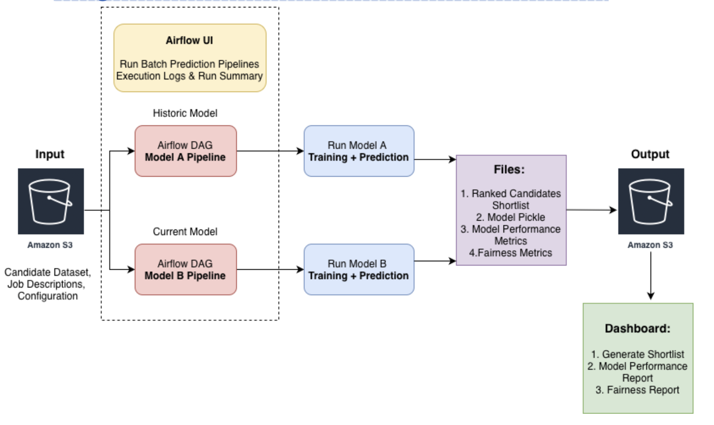

# FairHire: MLOps Fairness Auditing Framework

An end-to-end MLOps pipeline for detecting and monitoring bias in AI-driven hiring systems through automated fairness evaluation and drift detection.

---

## Overview

FairHire is an MLOps-driven fairness auditing framework designed to evaluate whether hiring models produce biased outcomes across demographic groups. Instead of acting as an ATS (Applicant Tracking System), FairHire analyzes existing model outputs using comprehensive fairness metrics to detect discrimination before deployment.

### Key Innovation

Two-model comparison framework that demonstrates fairness improvement by training identical models on biased vs. improved labels, enabling quantification of bias reduction over time.

### What Makes This Different

- Proactive bias detection before deployment
- Controlled experimental design isolates impact of label quality
- Production-ready MLOps with Airflow orchestration and S3 storage
- Academic rigor based on peer-reviewed fairness research

---

## Problem Statement

AI-driven hiring systems can inadvertently learn and amplify biases present in training data, leading to:

- Discriminatory hiring practices across race, gender, age, and disability status
- Legal compliance risks (EEOC violations, disparate impact lawsuits)
- Reputational damage and loss of diverse talent
- Lack of transparency in automated decision-making

Organizations need tools to audit hiring models before deployment, not after discrimination has occurred.

---

## Solution Architecture

 

The system follows a complete MLOps pipeline:

1. **Data Storage**: AWS S3 stores candidate datasets, job descriptions, and configurations
2. **Orchestration**: Airflow DAGs manage parallel training pipelines for both models
3. **Training**: PyCaret AutoML compares 9 algorithms and selects the best performer
4. **Prediction**: Batch prediction pipeline generates ranked candidate shortlists
5. **Analysis**: Fairness metrics calculated across demographic groups
6. **Visualization**: Streamlit dashboard displays results and drift alerts

---

## Why Two Models?

### Model A - Biased Model

**Purpose:** Represents an older or poorly-trained hiring model with fairness issues

- Trained on historical hiring decisions with embedded bias
- Uses only resume features (demographics excluded from training)
- Shows what happens when models learn from biased data

**Algorithm:** Random Forest Classifier (selected via AutoML)

### Model B - Unbiased Model

**Purpose:** Demonstrates fairness improvement through better training data

- Trained on corrected hiring decisions with bias mitigation applied
- Uses identical features as Model A
- Shows measurable fairness improvement
- Validates that bias reduction techniques work, serves as our baseline

**Algorithm:** LightGBM Classifier (selected via AutoML)

### The Experimental Design

**Control Variable:** Features (7 resume attributes - demographics excluded)

**Experimental Variable:** Training label quality (biased vs. unbiased)

**Hypothesis:** Models trained on improved labels will produce measurably fairer outcomes across demographic groups.

**Result:** Confirmed - Model B shows fairness improvement over Model A while maintaining strong performance.

---

## Key Features

### Automated Model Training

- PyCaret AutoML compares 9 classification algorithms
- Hyperparameter tuning with 50 iterations
- Model selection based on AUC-ROC metric
- Complete preprocessing pipelines saved with models

### Fairness-First Pipeline

- Demographics saved separately (never used as model features)
- Batch prediction with per-group fairness analysis
- Four fairness metrics calculated across Gender, Race, Age, Disability
- Automated threshold-based drift alerts

### MLOps Best Practices

- Airflow DAG orchestration for reproducible training
- S3-based storage for data and artifacts
- Version control for models and metrics
- Execution logs via Airflow UI monitoring

### Interactive Dashboard

- Job role filtering for targeted candidate review
- Side-by-side model comparison (A vs B)
- Fairness report visualization with charts
- Drift alert flagging when thresholds exceeded

---

## Fairness Metrics

Based on academic research: [Fairness in AI-Driven Recruitment (arXiv:2405.19699)](https://arxiv.org/pdf/2405.19699)

### 1. Demographic Parity

Measures equal hire rates across demographic groups.

**Formula:** `Max( P(Hire | Group A) - P(Hire | Group B) )`

**Interpretation:** Gap < 5% is fair, gap > 10% indicates potential bias

### 2. Selection Rate Parity (4/5 Rule)

Measures representation in top-K candidates.

**Formula:** `Min(Selection Rate) / Max(Selection Rate)`

**Interpretation:** Ratio >= 0.80 passes EEOC compliance, < 0.80 fails (disparate impact)

### 3. Equal Opportunity

Measures true positive rate parity for qualified candidates.

**Formula:** `Max( TPR(Group A) - TPR(Group B) )`

**Interpretation:** Gap < 10% is fair, gap > 10% indicates potential bias

### 4. Rank Ordering Bias

Measures average ranking position gaps.

**Formula:** `Max( Mean Rank(Group A) - Mean Rank(Group B) )`

**Interpretation:** Gap < 10 positions is minimal, gap > 15 positions indicates significant bias

---

## Project Structure
```
FairHire-AWS S3Bucket/
├── dags/
│   ├── utils/
│   ├── __init__.py
│   ├── config.py
│   ├── modelA_pipeline.py                    # Airflow DAG for Model A training
│   └── modelB_pipeline.py                    # Airflow DAG for Model B training
│
├── data/
│   └── processed/
│       ├── Dataset_A_processed.csv           # Model A preprocessed data
│       ├── Dataset_B_processed.csv           # Model B preprocessed data
│       ├── X_train.csv, X_test.csv           # Model A features
│       ├── X_train_modelB.csv, X_test_modelB.csv  # Model B features
│       ├── y_train.csv, y_test.csv           # Model A targets
│       ├── y_train_modelB.csv, y_test_modelB.csv  # Model B targets
│       ├── demographics_test.csv             # Model A demographics (for fairness analysis)
│       └── demographics_train_modelB.csv     # Model B demographics (for fairness analysis)
│
├── models/
│   ├── modelA/
│   │   └── manual__2025-12-[timestamp]/      # Model A training runs (timestamped)
│   │       ├── modelA_final.pkl
│   │       ├── modelA_metrics.json
│   │       ├── modelA_shortlist_base.csv
│   │       └── visualizations/
│   └── modelB/
│       └── manual__2025-12-[timestamp]/      # Model B training runs (timestamped)
│           ├── modelB_final.pkl
│           ├── modelB_metrics.json
│           ├── modelB_fairness_metrics.json
│           ├── modelB_shortlist_base.csv
│           └── visualizations/
│
└── requirements.txt                          # Python dependencies

notebooks/
├── Bias_dataset.ipynb                        # Bias dataset creation
├── Dataset_demographics.ipynb                # Demographics extraction
├── Data_processing_modelA.ipynb              # Model A data preprocessing pipeline
├── Data_processing_modelB.ipynb              # Model B data preprocessing pipeline
└── EDA.ipynb                                 # Exploratory data analysis

System_Architecture.png                       # System architecture diagram
fairhire_dashboard.py                         # Streamlit dashboard
README.md
.gitattributes                                # Git LFS configuration
.gitignore
```

**Note:** Model training runs are timestamped (e.g., `manual__2025-12-11T05:20:...` or `scheduled__2025-12-10T02:...`) to maintain version history and enable rollback capabilities.

## Results

### Model Performance Comparison

| Model | Algorithm | Accuracy | Precision | Recall | F1 Score | AUC-ROC | Predicted Hire Rate |
|-------|-----------|----------|-----------|--------|----------|---------|---------------------|
| Model A (Biased) | Random Forest | 69.5% | 81.4% | 80.9% | 81.1% | 0.53 | 81.2% |
| Model B (Fair) | LightGBM | 75.5% | 80.8% | 91.3% | 85.7% | 0.52 | 91.0% |

**Key Observation:** Model B achieves higher accuracy and recall while also demonstrating improved fairness across demographic groups.

### Fairness Metrics Comparison

| Metric | Model A (Biased) | Model B (Fair) | Improvement |
|--------|------------------|----------------|-------------|
| Avg. Demographic Parity Gap | 8.0% | 4.0% | 50% reduction |
| Avg. Selection Rate Ratio | 0.488 | 0.559 | 14.5% improvement |
| Demographic Parity - Race | 17.1% | 5.1% | 70% reduction |
| Selection Rate - Disabled | 0.599 | 0.734 | 22.5% improvement |
| **Fairness Score** | **57.1%** | **71.4%** | **+14.3 points** |

**Conclusion:** Model B demonstrates significant fairness improvement with a 14.3-point increase in overall fairness score (57.1% → 71.4%) while maintaining superior predictive performance. Key improvements include a 70% reduction in racial demographic parity gap and 50% reduction in average demographic parity across all groups, validating that unbiased training data quality leads to both better performance and better fairness outcomes.

---

## Technologies

### Machine Learning & AutoML
- PyCaret - AutoML framework
- scikit-learn - ML algorithms and metrics
- LightGBM - Gradient boosting
- pandas - Data manipulation
- numpy - Numerical computing

### MLOps & Orchestration
- Apache Airflow - Workflow orchestration
- AWS S3 - Object storage
- Pickle - Model serialization

### Fairness & Evaluation
- Custom `fairness_util.py` - Implements academic fairness metrics

### Visualization
- Streamlit - Interactive dashboard
- Plotly - Charts and visualizations
- Matplotlib / Seaborn - Static visualizations


## References
### Academic Papers
1. Raghavan, S., et al. (2024). *Fairness in AI-Driven Recruitment: Challenges, Metrics, Methods, and Future Directions.* [arXiv:2405.19699](https://arxiv.org/abs/2405.19699).
### Dataset Used:
2. https://www.kaggle.com/datasets/mdtalhask/ai-powered-resume-screening-dataset-2025

---

**Course:** Machine Learning Operations (MLOps)  
**Institution:** University of Chicago  
**Quarter:** Autumn 2025

## Team Members:
1. Amulya Jayanthi
2. Akanksha Mathpati
3. Sahil Bharwani
4. Sumasree Ragi

**Built for fairness in AI hiring**
